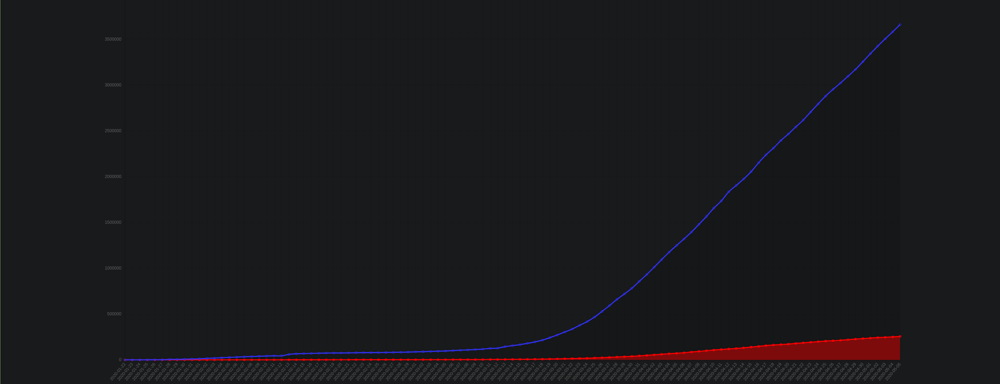
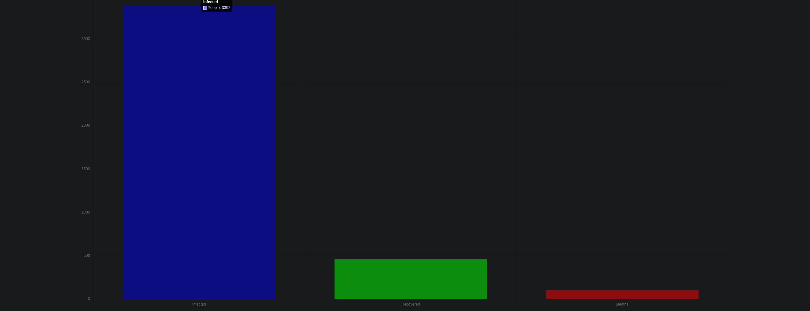

# COVID-19-Tracker
In order to keep my skills sharp during the pandemic, I decided to make a corona virus 
tracker using the https://covid19.mathdro.id/api API.

# How to use
### You must clone the repo, install all the dependencies, and run a script.

```
$ git clone https://github.com/PedroNunezCode/COVID-19-Tracker.git
$ cd COVID-19-Tracker && npm install
$ npm run start
```

# This is how the app looks once compiled.





## Thanks for looking and let me know if you add anything to it!
